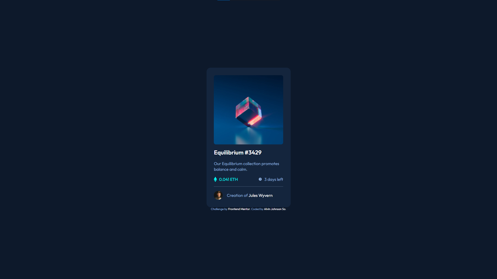
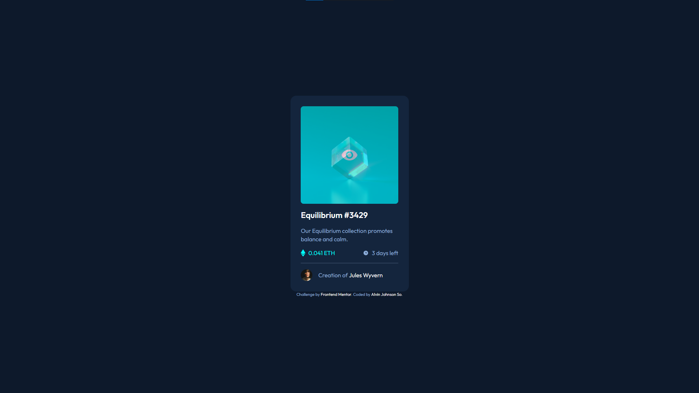
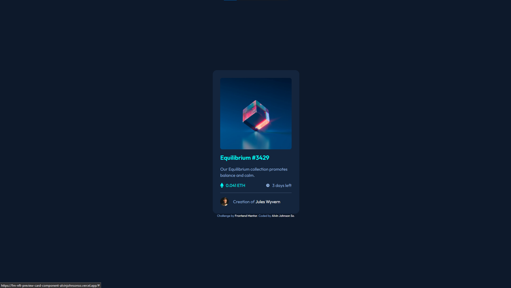
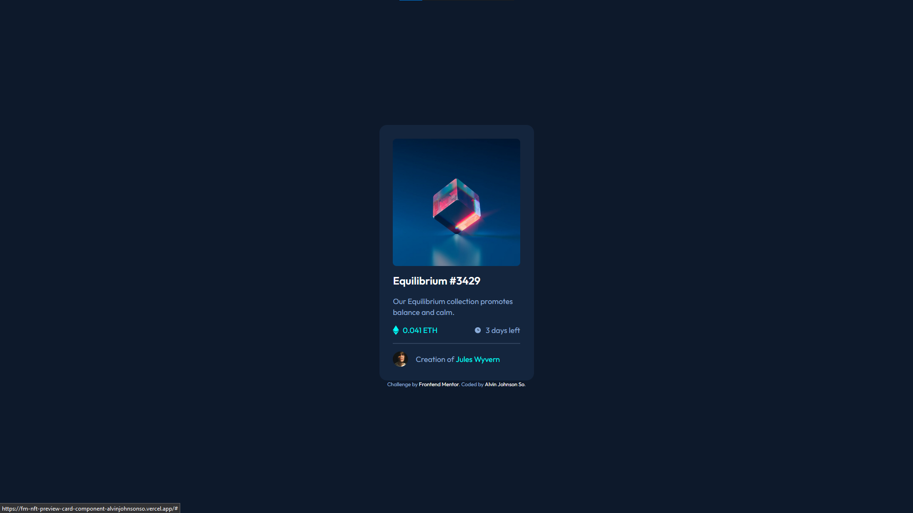
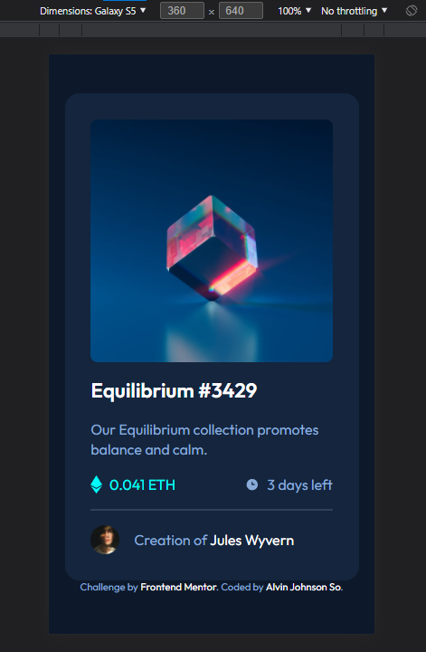

# Frontend Mentor - NFT preview card component solution

This is a solution to the [NFT preview card component challenge on Frontend Mentor](https://www.frontendmentor.io/challenges/nft-preview-card-component-SbdUL_w0U). Frontend Mentor challenges help you improve your coding skills by building realistic projects.

## Table of contents

- [Overview](#overview)
  - [The challenge](#the-challenge)
  - [Screenshot](#screenshot)
  - [Links](#links)
- [My process](#my-process)
  - [Built with](#built-with)
  - [What I learned](#what-i-learned)
  - [Continued development](#continued-development)
  - [Useful resources](#useful-resources)
- [Author](#author)
- [Acknowledgments](#acknowledgments)

**Note: Delete this note and update the table of contents based on what sections you keep.**

## Overview

### The challenge

Users should be able to:

- View the optimal layout depending on their device's screen size
- See hover states for interactive elements

### Screenshot

### Links

- [Solution URL](https://www.frontendmentor.io/solutions/card-component-built-with-flexbox-using-sass-cLaJ8MFBv)
- [Live Site URL](https://fm-nft-preview-card-component-alvinjohnsonso.vercel.app/)

## My process

### Built with

- HTML5 markup
- Sass
- Flexbox
- Mobile-first workflow

### What I learned

- Complete usage of flexbox.
- Absolute positioning within divs.
- Sass preprocessor and the [7-1 (7 folders 1 file) pattern](https://itnext.io/structuring-your-sass-projects-c8d41fa55ed4)
- Was trying out the Mobile-first workflow but I'm not sure if I was able to apply it correctly here since I just set the viewport height to `100` and didn't bother to do any media queries to have it responsive.
- rem vs px

### Continued development

- CSS Grid
- CSS Transitions and animations for fluidity.
- Usage of web frameworks (React JS, Vue JS, etc.)
- Usage of pre-compilers (Webpack)

### Useful resources

- [Structuring your Sass Projects](https://itnext.io/structuring-your-sass-projects-c8d41fa55ed4) - This helped me for the Sass file structure. As stated above, this is where I got the 7-1 pattern for the file structure.
- [A Complete Guide to Flexbox](https://css-tricks.com/snippets/css/a-guide-to-flexbox/) - Familarity for using flexbox.

## Author

- Website - ATM, none.
- Frontend Mentor - [@alvinjohnsonso](https://www.frontendmentor.io/profile/alvinjohnsonso)
- Twitter - [@alvinjohnsonso](https://www.twitter.com/alvinjohnsonso)
